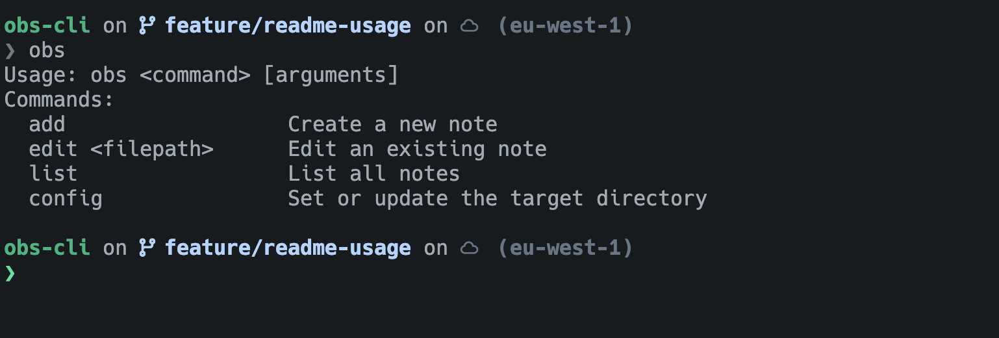
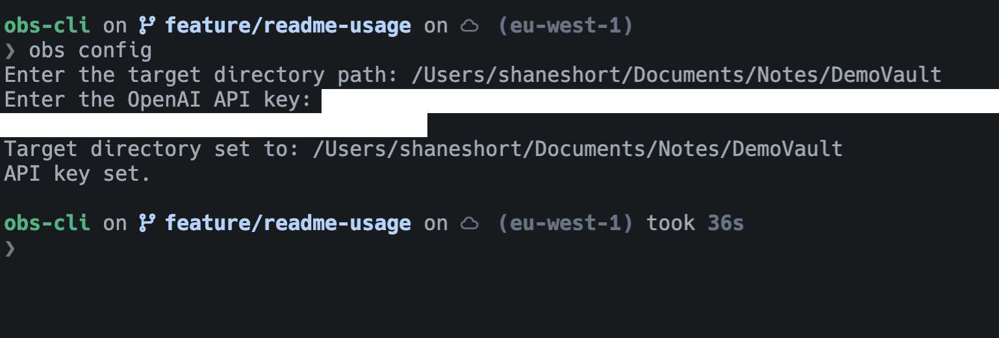
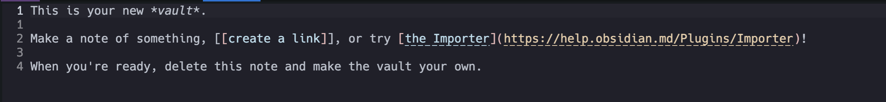
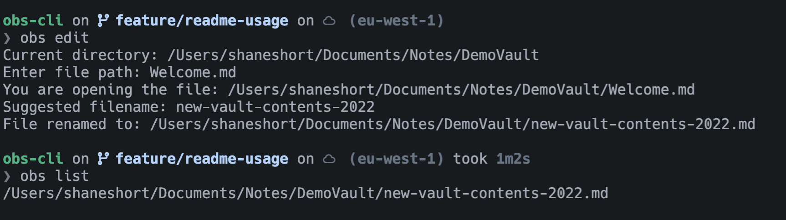
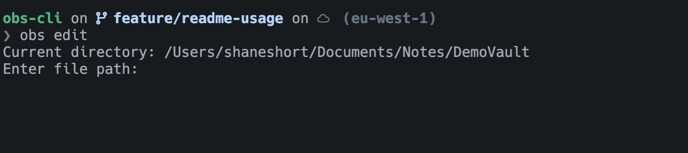

# Silica-CLI

A CLI tool for managing Obsidian notes via neovim. WIP.

## Installing
Clone the directory, then build using 
`make` 
and install using 
`make install`
You may need to give execute permissions on
the executable with `sudo chmod +x /usr/local/bin/silica`.

## Usage
The tool can be used either via the command line or a TUI. The command line has four options currently (more to be added):

`obs config` is used to initially set the location of your obsidian vault, and your OpenAI API key (to be used for parsing file contents and renaming files).

`obs list` will list any notes associated with the current working directory. If the current working directory is a git repository then this will be under a path like `/<git organisation/user>/<repository name>`. Otherwise it will be under `/temp`. If we use obsidian for storing the vault then an automatically created welcome file will also be created in your vault. 

Which when closed will be renamed as:

`obs add` will create a new note in either `/temp` or the git path. The contents of the file will be passed to the `file_parsing` method, which uses your OpenAI key to parse the contents of the file and rename it (this is now handled by the `obs clean` option so that we can keep sensitive notes out of OpenAI's hands).

`obs edit <filename>` is used to edit a previously existing note in the current working directory. This option uses the `readline` tool to give auto-complete suggestions for the file paths in the target directory.

The TUI is launched simply by `silica`, navigation is done using vim-style 'hjkl' keybindings, 'n/N' for scrolling through data, 'enter' to select an option, and 'q' to exit.

## Features in progress
 - Add obsidian links between notes in the same repo
 - Add a backup option to push repositories notes to git, use the correct git profile for work vs personal repositories 
 - A TUI similar to lazygit

